 

Software engineer in Utah building full-stack web apps end to end: schema, API, UI, deploy. Most of my work is Next.js, TypeScript, and Postgres. I run [Subsecond Studio](https://subsecondstudio.com), building small, fast web products for clients.

### Currently

Building [Subsecond Studio](https://subsecondstudio.com) and writing about the parts of solo product work that don't usually get written down: migrations, testing, cost, and where the time actually goes.

### Latest writing

<!-- LATEST_POSTS -->
- [Quest 3 Webxr Passthrough Nextjs React Three Fiber](https://thomas-hart.com/blog/quest-3-webxr-passthrough-nextjs-react-three-fiber) &nbsp;·&nbsp; Jul 2026
- [How I Handle Auth in Small SaaS Without Rolling My Own](https://thomas-hart.com/blog/handle-auth-small-saas-without-rolling-own) &nbsp;·&nbsp; Jul 2026
- [How I Set Up Real End-to-End Tests for Next.js with Playwright](https://thomas-hart.com/blog/real-end-to-end-tests-nextjs-playwright-chrome) &nbsp;·&nbsp; Jun 2026
<!-- /LATEST_POSTS -->

More at [thomas-hart.com/blog](https://thomas-hart.com/blog).

### Recently shipped

<!-- RECENT_SHIP -->
- [obs-phone-cam](https://github.com/ThomasHartDev/obs-phone-cam) — Use your iPhone as a low-latency OBS camera source over your LAN. No app, no fee. &nbsp;·&nbsp; today
- [chess-cameo](https://github.com/ThomasHartDev/chess-cameo) — TypeScript &nbsp;·&nbsp; today
<!-- /RECENT_SHIP -->

### Selected work

- [Forbidden Street](https://thomas-hart.com/projects/forbidden-street) — brand and site build
- [Photo Atlas](https://thomas-hart.com/projects/photo-atlas) — image pipeline and search
- [Subsecond Studio](https://thomas-hart.com/projects/subsecond-studio) — the studio itself

### Stack

### Reach me

[Portfolio](https://thomas-hart.com) &nbsp;·&nbsp; [Subsecond Studio](https://subsecondstudio.com) &nbsp;·&nbsp; [Email](mailto:thomashartdev@gmail.com)

   
  

