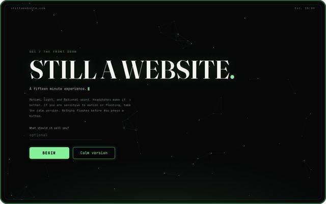
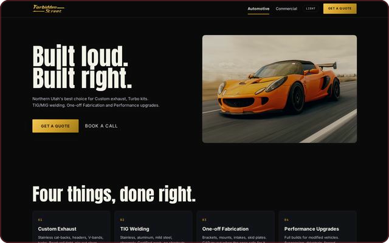
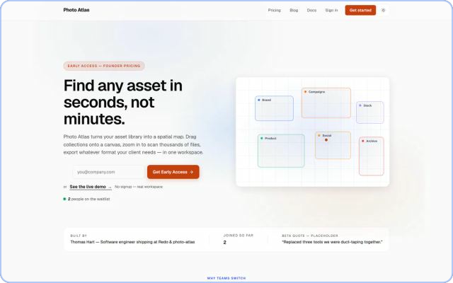
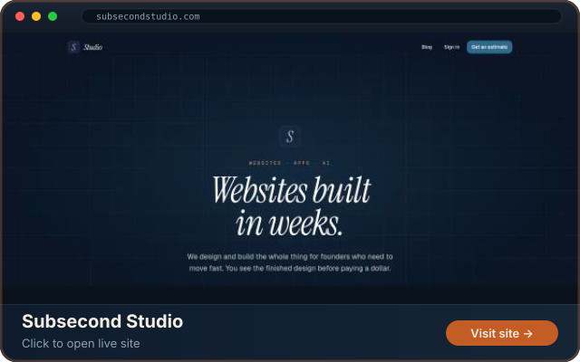

  

 

  I'm a software engineer and BYU alum. I specialize in building lightning-fast web apps with TypeScript, React, SQL, and many other tools (listed below). My corporate + agency work has reached over 100 million users and counting.

 

### Featured Work

  &nbsp;
  

  <a href="https://stillawebsite.com">Still A Website</a>
  &nbsp;·&nbsp;
  <a href="https://forbidden-street.com">Forbidden Street</a>

  &nbsp;
  

  <a href="https://atlas-photo.com">Photo Atlas</a>
  &nbsp;·&nbsp;
  <a href="https://subsecondstudio.com">Subsecond Studio</a>

### Projects

<!-- RECENT_PROJECTS -->
- **[event-broker-lab](https://github.com/ThomasHartDev/event-broker-lab)** — In-memory message broker from scratch: pub/sub, work queues, delivery guarantees, and backpressure.
- **[airlock](https://github.com/ThomasHartDev/airlock)** — Ephemeral zero-credential sandbox for untrusted or agent-generated code, with self-verifying execution.
- **[image-processing](https://github.com/ThomasHartDev/image-processing)** — Sharp optimizer that binary-searches encoder quality against an SSIM target.
- **[obs-phone-cam](https://github.com/ThomasHartDev/obs-phone-cam)** — Turns an iPhone into a low-latency OBS camera over the LAN.
- **[modern-frontend-lab](https://github.com/ThomasHartDev/modern-frontend-lab)** — Living Next.js 15 + React 19 lab: Server Components, streaming, optimistic UI, state, virtualization, Core…
- **[neetcode-submissions](https://github.com/ThomasHartDev/neetcode-submissions)** — My NeetCode.io problem submissions
- **[office-aesthetics](https://github.com/ThomasHartDev/office-aesthetics)** — Nuxt 3 SSR ecommerce store for home office furniture, with product variants, PayPal/Square/Amazon Pay…
<!-- /RECENT_PROJECTS -->

### Stack

Languages 

Frontend 

Backend 

Data 

Infrastructure 

Tools 

AI 

---

  <a href="mailto:thomashartdev@gmail.com">thomashartdev@gmail.com</a>
  &nbsp;·&nbsp;
  <a href="https://thomas-hart.com/blog">Blog</a>
  &nbsp;·&nbsp;
  <a href="https://thomas-hart.com">Portfolio</a>
  &nbsp;·&nbsp;
  <a href="https://subsecondstudio.com">Studio</a>
  &nbsp;·&nbsp;
  <a href="https://github.com/ThomasHartDev?tab=repositories">Repos</a>

